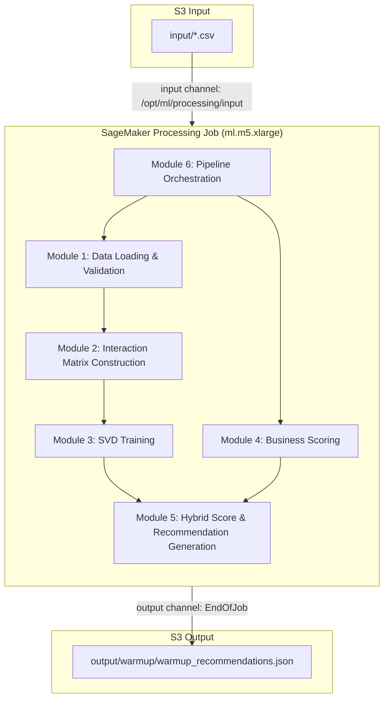

# Design Document: ML Recommendation Model

## Overview

This design defines the architecture for a hybrid ML recommendation model that combines TruncatedSVD collaborative filtering with business heuristics to generate cache warmup predictions. The system evolves the existing heuristic-only recommender (v1, `recommender.py`) into a production-ready ML pipeline (`recommender_ml.py`) deployed as a SageMaker Processing Job.

The core insight is that access frequency patterns encode latent user preferences. By factorizing a customer×document interaction matrix via TruncatedSVD, we capture collaborative filtering signals (customers who query similar documents have similar future needs), then blend them with proven business heuristics (volume, recency decay, billing/inquiry weights) for a hybrid score that outperforms either approach alone.

**Key design decisions:**
- **TruncatedSVD over ALS**: Chosen for scipy sparse matrix compatibility, single-pass training, and availability in the SageMaker scikit-learn managed image without additional dependencies.
- **log1p transformation**: Dampens power-law frequency distributions common in credit bureau access logs.
- **Hybrid scoring**: ML signal (W_MF=0.45) is slightly less weighted than business heuristics (W_BIZ=0.55) to ensure domain expertise dominates while ML captures latent patterns.
- **Modular pipeline**: Six distinct modules enable independent testing and future evolution of each stage.

## Architecture



### Data Flow

1. CSV files are available in `s3://<bucket>/input/`
2. The SageMaker Processing Job mounts them at `/opt/ml/processing/input` and runs `recommender_ml.py`
3. The recommender executes the 6-module pipeline and writes `warmup_recommendations.json` to `/opt/ml/processing/output`
4. SageMaker uploads the output to `s3://<bucket>/output/warmup/` at EndOfJob

### Execution Environment

| Property | Value |
|----------|-------|
| Container Image | `683313688378.dkr.ecr.{region}.amazonaws.com/sagemaker-scikit-learn:1.2-1-cpu-py3` |
| Instance Type | ml.m5.xlarge (4 vCPU, 16 GB RAM) |
| Volume | 20 GB |
| Max Runtime | 3600 seconds |
| Python Version | 3.10+ |
| Dependencies | pandas, numpy, scipy, scikit-learn, boto3 (all pre-installed) |

## Components and Interfaces

### Module 1: Data Loading & Validation (`load_data`, `prepare`)

**Responsibility**: Load all CSV files from the input channel, validate types, clean strings, compute temporal features.

```python
def load_data(input_dir: str) -> pd.DataFrame:
    """Load and concatenate all CSV files from the SageMaker input directory.

    Args:
        input_dir: Path to the SageMaker input channel (default: /opt/ml/processing/input)

    Returns:
        Concatenated DataFrame of all CSV files

    Raises:
        FileNotFoundError: If no .csv files exist in input_dir
    """

def prepare(df: pd.DataFrame) -> tuple[pd.DataFrame, pd.Timestamp]:
    """Clean, type-cast, and compute temporal features.

    Transformations:
        - inclusionDate → datetime
        - billing, inquiry, post_report_view → boolean int (0/1)
        - httpTime, httpStatus → numeric (NaN → 0)
        - String columns → stripped of whitespace and quotes
        - delta_days = (t_ref - inclusionDate) / 86400

    Args:
        df: Raw DataFrame from load_data

    Returns:
        Tuple of (cleaned DataFrame, reference timestamp t_ref)
    """
```

### Module 2: Interaction Matrix Construction (`build_interaction_matrix`)

**Responsibility**: Build the sparse customer×document frequency matrix with log1p transformation.

```python
def build_interaction_matrix(
    df: pd.DataFrame
) -> tuple[csr_matrix, dict[str, int], dict[str, int], np.ndarray, np.ndarray]:
    """Build sparse interaction matrix from access logs.

    Pipeline:
        1. Count interactions per (customerDocument, consultedDocument) pair
        2. Apply log1p to raw counts (dampens power-law distribution)
        3. Construct CSR sparse matrix
        4. Build bidirectional index mappings

    Args:
        df: Prepared DataFrame

    Returns:
        Tuple of (csr_matrix, cust_to_idx, doc_to_idx, customers_array, documents_array)
    """
```

### Module 3: SVD Training & Evaluation (`train_svd`, `evaluate_model`)

**Responsibility**: Train TruncatedSVD on the interaction matrix and evaluate reconstruction quality.

```python
def train_svd(
    matrix: csr_matrix, n_components: int, n_iter: int
) -> tuple[TruncatedSVD, np.ndarray, np.ndarray, float]:
    """Train TruncatedSVD on the interaction matrix.

    Automatically reduces n_components if it exceeds min(n_customers, n_documents) - 1.
    Uses random_state=42 for reproducibility.

    Args:
        matrix: CSR sparse interaction matrix
        n_components: Target latent dimensions (default 50)
        n_iter: Power iteration count (default 15)

    Returns:
        Tuple of (svd_model, user_factors, item_factors, explained_variance_ratio)
    """

def evaluate_model(
    matrix: csr_matrix, svd: TruncatedSVD,
    user_factors: np.ndarray, item_factors: np.ndarray
) -> float:
    """Compute reconstruction RMSE on sampled non-zero entries.

    Samples up to 5000 users, reconstructs their vectors, and measures
    RMSE only on non-zero entries (avoids sparse zero bias).

    Returns 0.0 if no non-zero entries exist in the sample.
    """
```

### Module 4: Scoring (`score_business`, `get_mf_scores_for_pairs`, `compute_hybrid_pairs`)

**Responsibility**: Compute business scores per dimension and hybrid scores for pairs.

```python
def score_business(
    df: pd.DataFrame, group_cols: list[str], max_vol: int, max_lat: float
) -> pd.DataFrame:
    """Compute business heuristic score for each group.

    Formula: biz_score = ALPHA * V_norm + BETA * exp(-LAMBDA_DECAY * delta_mean) + GAMMA * W_biz
    Where W_biz = 0.30*billing + 0.25*inquiry + 0.25*post_view + 0.20*latency_norm
    """

def get_mf_scores_for_pairs(
    df: pd.DataFrame, user_factors: np.ndarray, item_factors: np.ndarray,
    cust_to_idx: dict[str, int], doc_to_idx: dict[str, int]
) -> pd.DataFrame:
    """Compute normalized MF scores for all observed customer-document pairs.

    - Dot product of user_factor · item_factor for known pairs
    - 0.0 for unknown customers/documents
    - MinMaxScaler normalization to [0, 1]
    """

def compute_hybrid_pairs(
    df: pd.DataFrame, user_factors: np.ndarray, item_factors: np.ndarray,
    cust_to_idx: dict[str, int], doc_to_idx: dict[str, int],
    max_vol: int, max_lat: float
) -> pd.DataFrame:
    """Combine MF and business scores into hybrid score for pairs.

    Formula: score_final = W_MF * mf_score + W_BIZ * biz_score
    """
```

### Module 5: Recommendation Generation (`to_recs`, `generate_recommendations`)

**Responsibility**: Select top-N items per dimension and assemble the output payload.

```python
def to_recs(
    df_dim: pd.DataFrame, cols: list[str], n: int, score_col: str = "biz_score"
) -> list[dict]:
    """Convert scored DataFrame to list of recommendation dicts.

    Each dict contains: identifier columns + volume (int) + score (float, 4 decimals)
    """

def generate_recommendations(
    df: pd.DataFrame, hybrid_pairs: pd.DataFrame,
    t_ref: pd.Timestamp, model_metrics: dict
) -> dict:
    """Assemble the complete output payload with all 5 dimensions.

    Dimensions:
        - top_reports: by Business_Score (grouped by reportName, TYPE_REPORT)
        - top_features: by Business_Score (grouped by ID_FEATURE, FEATURENAME, FEATURE_TYPE)
        - top_customers: by Business_Score (grouped by customerDocument)
        - top_consulted_documents: by Business_Score (grouped by consultedDocument)
        - top_pairs: by Hybrid_Score (grouped by customerDocument, consultedDocument)
    """
```

### Module 6: Pipeline Orchestration (`run`)

**Responsibility**: Execute the full pipeline in sequence, manage timing, write output JSON.

```python
def run() -> str:
    """Execute the complete ML recommendation pipeline.

    Steps:
        1. Load and validate data
        2. Build interaction matrix
        3. Train SVD model
        4. Evaluate model quality
        5. Compute hybrid scores for pairs
        6. Generate recommendations across all dimensions
        7. Write output JSON
        8. Log summary and top-5 pairs

    Returns:
        Path to the output JSON file
    """
```

## Data Models

### Input Schema (pipe-separated CSV)

| Column | Type | Description |
|--------|------|-------------|
| ID_REPORT | string | Report identifier |
| reportName | string | Report type name |
| TYPE_REPORT | string | PJ or PF |
| ID_FEATURE | string | Feature identifier |
| FEATURENAME | string | Feature name |
| FEATURE_TYPE | string | Feature type code |
| channel | string | Access channel |
| billing | int/bool | Whether billing occurred |
| inquiry | int/bool | Whether inquiry occurred |
| post_report_view | int/bool | Whether post-report view occurred |
| httpStatus | numeric | HTTP response status code |
| httpTime | numeric | Response time in ms |
| inclusionDate | datetime | Timestamp of the access |
| customerDocument | string | Customer identifier (CNPJ/CPF) |
| consultedDocument | string | Consulted document identifier |

### Output JSON Schema (`warmup_recommendations.json`)

```json
{
  "generated_at": "2024-01-15T14:30:00.000000",
  "model_version": "2.0-hybrid-svd",
  "model_params": {
    "formula": "score_final = w_mf · score_mf + w_biz · (α·V_norm + β·exp(-λ·Δt) + γ·W_biz)",
    "W_biz_formula": "W = 0.30·billing + 0.25·inquiry + 0.25·post_view + 0.20·latency_norm",
    "alpha": 0.35,
    "beta": 0.40,
    "gamma": 0.25,
    "lambda": 0.15,
    "w_mf": 0.45,
    "w_biz": 0.55,
    "svd_components": 50,
    "svd_iterations": 15
  },
  "model_metrics": {
    "svd_explained_variance_pct": 72.5,
    "svd_reconstruction_rmse": 0.1234,
    "matrix_shape": [15000, 80000],
    "matrix_density_pct": 0.05,
    "n_interactions": 600000,
    "training_time_seconds": 45.2
  },
  "warmup_targets": {
    "top_reports": [{"reportName": "...", "TYPE_REPORT": "PJ", "volume": 102007, "score": 0.7647}],
    "top_features": [{"ID_FEATURE": "...", "FEATURENAME": "...", "FEATURE_TYPE": "O", "volume": 1, "score": 0.96}],
    "top_customers": [{"customerDocument": "...", "volume": 111622, "score": 0.70}],
    "top_consulted_documents": [{"consultedDocument": "...", "volume": 500, "score": 0.65}],
    "top_pairs": [{"customerDocument": "...", "consultedDocument": "...", "volume": 89, "score": 0.82}]
  },
  "stats": {
    "total_records": 724000,
    "unique_customers": 15000,
    "unique_consulted": 80000,
    "unique_reports": 20,
    "unique_features": 150,
    "date_range": {"from": "2024-01-01", "to": "2024-01-15"}
  }
}
```

### Interaction Matrix

- **Type**: scipy CSR sparse matrix
- **Shape**: (n_unique_customers × n_unique_documents)
- **Values**: log1p(access_count) — float32
- **Density**: Typically ~0.05% for the ~724K record dataset

### Index Mappings

```python
cust_to_idx: dict[str, int]  # customerDocument → row index
doc_to_idx: dict[str, int]   # consultedDocument → column index
```

### Configuration Parameters

| Parameter | Type | Default | Source |
|-----------|------|---------|--------|
| ALPHA | float | 0.35 | env var |
| BETA | float | 0.40 | env var |
| GAMMA | float | 0.25 | env var |
| LAMBDA_DECAY | float | 0.15 | env var |
| W_MF | float | 0.45 | env var |
| W_BIZ | float | 0.55 | env var |
| N_COMPONENTS | int | 50 | env var |
| N_ITER | int | 15 | env var |
| TOP_N_REPORTS | int | 20 | env var |
| TOP_N_FEATURES | int | 30 | env var |
| TOP_N_CUSTOMERS | int | 500 | env var |
| TOP_N_CDOCS | int | 1000 | env var |
| TOP_N_PAIRS | int | 2000 | env var |
| SM_INPUT_DIR | str | /opt/ml/processing/input | env var |
| SM_OUTPUT_DIR | str | /opt/ml/processing/output | env var |
| CSV_SEP | str | \| | env var |


## Correctness Properties

*A property is a characteristic or behavior that should hold true across all valid executions of a system — essentially, a formal statement about what the system should do. Properties serve as the bridge between human-readable specifications and machine-verifiable correctness guarantees.*

### Property 1: Data loading concatenation preserves all records

*For any* set of N valid pipe-separated CSV files placed in the input directory, calling `load_data` SHALL produce a DataFrame whose row count equals the sum of the row counts of the individual files.

**Validates: Requirements 1.1**

### Property 2: Type coercion and string cleaning in prepare

*For any* DataFrame with valid columns, after calling `prepare`: (a) `billing`, `inquiry`, and `post_report_view` columns SHALL contain only values 0 or 1; (b) `httpTime` and `httpStatus` SHALL contain no NaN values; (c) all string columns (reportName, TYPE_REPORT, FEATURENAME, FEATURE_TYPE, customerDocument, consultedDocument) SHALL contain no leading/trailing whitespace or quotation marks.

**Validates: Requirements 1.3, 1.4, 13.4**

### Property 3: Delta days temporal computation

*For any* DataFrame with a valid `inclusionDate` column, after calling `prepare`, the `delta_days` value for each row SHALL equal `(max_inclusionDate - row_inclusionDate).total_seconds() / 86400.0`, and the row with the maximum inclusionDate SHALL have `delta_days == 0.0`.

**Validates: Requirements 1.5**

### Property 4: Interaction matrix values equal log1p of raw counts

*For any* DataFrame with (customerDocument, consultedDocument) pairs, the value at position (cust_to_idx[c], doc_to_idx[d]) in the constructed CSR matrix SHALL equal `log1p(count)` where `count` is the number of rows with that (c, d) pair in the input DataFrame.

**Validates: Requirements 2.1, 2.2**

### Property 5: Matrix shape and index mapping consistency

*For any* DataFrame, the constructed interaction matrix SHALL have shape `(n_unique_customers, n_unique_documents)`, the `cust_to_idx` mapping SHALL have exactly `n_unique_customers` entries mapping to indices `[0, n_unique_customers)`, and `doc_to_idx` SHALL have exactly `n_unique_documents` entries mapping to indices `[0, n_unique_documents)`.

**Validates: Requirements 2.3, 2.4**

### Property 6: SVD output shapes respect component clamping

*For any* sparse matrix of shape (m, n) and requested `n_components` value, `train_svd` SHALL produce `user_factors` of shape `(m, actual_components)` and `item_factors` of shape `(n, actual_components)` where `actual_components = min(n_components, m - 1, n - 1)`, without raising an error.

**Validates: Requirements 3.1, 3.2, 3.3, 13.1**

### Property 7: SVD training reproducibility

*For any* sparse matrix, calling `train_svd` twice with the same input SHALL produce identical `user_factors` and `item_factors` arrays (due to `random_state=42`).

**Validates: Requirements 3.4**

### Property 8: Reconstruction RMSE uses only non-zero entries

*For any* interaction matrix and trained SVD model, the `evaluate_model` function SHALL compute RMSE exclusively over positions where the original matrix has non-zero values, and SHALL return 0.0 if no non-zero entries exist in the evaluation sample.

**Validates: Requirements 4.1, 4.2, 4.4, 13.3**

### Property 9: MF score computation (known pairs = dot product, unknown = 0.0)

*For any* customer-document pair: if both identifiers exist in the index mappings, the raw MF score SHALL equal the dot product of `user_factors[cust_idx]` and `item_factors[doc_idx]`; if either identifier is missing from the mappings, the MF score SHALL be 0.0.

**Validates: Requirements 5.1, 5.2, 13.2**

### Property 10: MF score normalization bounds

*For any* set of raw MF scores with at least 2 distinct values, after MinMaxScaler normalization, all resulting MF scores SHALL be in the closed interval [0.0, 1.0].

**Validates: Requirements 5.3**

### Property 11: Business score formula correctness

*For any* aggregated group with values (volume, delta_mean, billing_mean, inquiry_mean, view_mean, httpTime_mean) and normalization constants (max_vol, max_lat), the computed business score SHALL equal `ALPHA * (volume / max_vol) + BETA * exp(-LAMBDA_DECAY * delta_mean) + GAMMA * (0.30 * billing_mean + 0.25 * inquiry_mean + 0.25 * view_mean + 0.20 * (httpTime_mean / max_lat))`.

**Validates: Requirements 6.2, 6.3**

### Property 12: Hybrid score formula correctness

*For any* pair with MF score `mf` and business score `biz`, the hybrid score SHALL equal `W_MF * mf + W_BIZ * biz`. When a pair has no MF score (missing from merge), `mf` SHALL default to 0.0.

**Validates: Requirements 6.1, 6.4**

### Property 13: Recommendation dimensions sorted descending by score

*For any* generated recommendations output: (a) top_reports, top_features, top_customers, and top_consulted_documents SHALL be sorted by Business_Score descending; (b) top_pairs SHALL be sorted by Hybrid_Score descending. That is, for consecutive entries i and i+1 in any dimension, `entry[i].score >= entry[i+1].score`.

**Validates: Requirements 6.5, 7.3, 7.4**

### Property 14: Top-N list length bounded by configuration

*For any* recommendation dimension with `total_items` available items and configured limit `TOP_N`, the output list length SHALL equal `min(TOP_N, total_items)`.

**Validates: Requirements 7.2**

### Property 15: Recommendation entries contain volume and rounded score

*For any* recommendation entry in any dimension of the output, the entry SHALL contain a `volume` field with an integer value and a `score` field with a float value rounded to exactly 4 decimal places.

**Validates: Requirements 7.5**

## Error Handling

| Scenario | Handling Strategy | Requirement |
|----------|-------------------|-------------|
| No CSV files in input directory | Raise `FileNotFoundError` with descriptive message including the directory path | 1.2 |
| N_COMPONENTS > min(m, n) - 1 | Silently clamp to max allowable value and proceed | 3.2, 13.1 |
| Unknown customer/document in MF score computation | Return 0.0 for the pair without exception | 5.2, 13.2 |
| No non-zero entries in evaluation sample | Return RMSE = 0.0 | 4.4, 13.3 |
| Non-numeric `httpTime` values | Coerce to numeric with `errors="coerce"`, fill NaN with 0 | 1.3, 13.4 |
| Non-numeric `httpStatus` values | Coerce to numeric with `errors="coerce"`, fill NaN with 0 | 1.3 |
| MF score missing after left join | Fill NaN with 0.0 before hybrid calculation | 6.4 |

**Design principle**: The pipeline favors degraded output over failure. Edge cases in data quality (missing values, unknown identifiers, small matrices) are handled gracefully with fallback defaults, allowing the pipeline to always produce valid JSON output.

## Testing Strategy

### Property-Based Testing

This feature is well-suited for property-based testing because:
- The core logic consists of pure mathematical functions (scoring formulas, matrix operations)
- Input varies significantly (any DataFrame structure, any parameter combination)
- Properties are universally quantified across all valid inputs

**Library**: [Hypothesis](https://hypothesis.readthedocs.io/) (Python's standard PBT library, available via pip)

**Configuration**:
- Minimum 100 examples per property test
- Use `@settings(max_examples=200)` for complex properties
- Use `@given` with custom strategies for DataFrames and sparse matrices
- Tag format: `# Feature: ml-recommendation-model, Property N: <title>`

**Custom Strategies needed**:
- `st_access_log_df()`: Generates random DataFrames with valid column schema
- `st_sparse_interaction_matrix()`: Generates random CSR matrices of varying density
- `st_factor_matrices()`: Generates random user/item factor pairs
- `st_scoring_params()`: Generates valid (ALPHA, BETA, GAMMA, LAMBDA_DECAY) tuples that are non-negative

### Unit Tests (Example-Based)

| Test | Validates |
|------|-----------|
| `test_load_data_empty_directory_raises` | Req 1.2 |
| `test_output_json_has_required_top_level_keys` | Req 8.2 |
| `test_model_metrics_has_required_keys` | Req 8.3, 4.3 |
| `test_stats_has_required_keys` | Req 8.4 |
| `test_model_version_is_2_0_hybrid_svd` | Req 12.1 |
| `test_model_params_includes_all_fields` | Req 12.2 |
| `test_generated_at_is_valid_iso_format` | Req 12.3 |
| `test_output_dimensions_have_5_keys` | Req 7.1 |
| `test_default_config_values` | Req 10.1-10.5 |

### Integration Tests

| Test | Validates |
|------|-----------|
| `test_output_json_written_to_correct_path` | Req 8.1 |
| `test_json_encoding_utf8_no_ascii` | Req 8.5 |
| `test_logging_pipeline_stages` | Req 11.1-11.5 |

### Test Infrastructure Setup

Since the project currently has no test framework, the following setup is needed:

```bash
pip install pytest hypothesis numpy pandas scipy scikit-learn
```

Test file structure:
```
tests/
├── conftest.py              # Shared fixtures and Hypothesis strategies
├── test_data_loading.py     # Properties 1-3 + unit tests for Req 1
├── test_matrix.py           # Properties 4-5 + unit tests for Req 2
├── test_svd.py              # Properties 6-8 + unit tests for Req 3-4
├── test_scoring.py          # Properties 9-12 + unit tests for Req 5-6
└── test_recommendations.py  # Properties 13-15 + unit tests for Req 7-8
```
